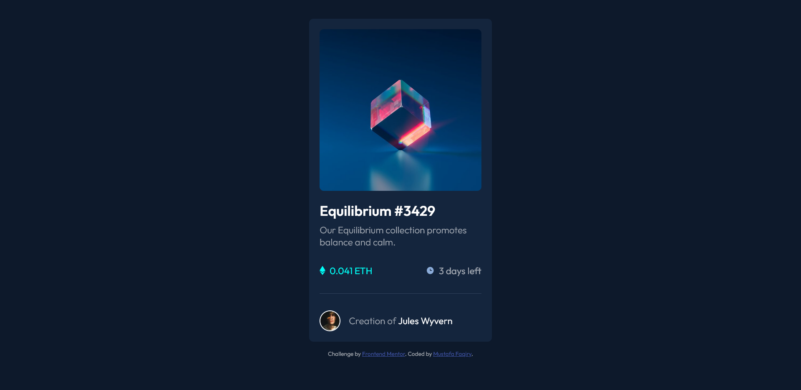

# Frontend Mentor - NFT preview card component solution

This is a solution to the [NFT preview card component challenge on Frontend Mentor](https://www.frontendmentor.io/challenges/nft-preview-card-component-SbdUL_w0U). Frontend Mentor challenges help you improve your coding skills by building realistic projects.

## Table of contents

- [Screenshot](#screenshot)
- [Links](#links)
  - [Built with](#built-with)
- [Author](#author)

### Screenshot

### Links

- Solution URL: (https://github.com/mustafafaqiry/FEM-nft-preview)
- Live Site URL: (https://mustafafaqiry.github.io/FEM-nft-preview/)

### Built with

- Semantic HTML5 markup
- CSS custom properties
- Flexbox
- Mobile-first workflow
- [React](https://reactjs.org/) - JS library
- [Next.js](https://nextjs.org/) - React framework
- [Styled Components](https://styled-components.com/) - For styles

If you want more help with writing markdown, we'd recommend checking out [The Markdown Guide](https://www.markdownguide.org/) to learn more.

## Author

- Website - [Mustafa faqiry](https://github.com/mustafafaqiry)
- Frontend Mentor - [@mustafafaqiry](https://www.frontendmentor.io/profile/mustafafaqiry)
